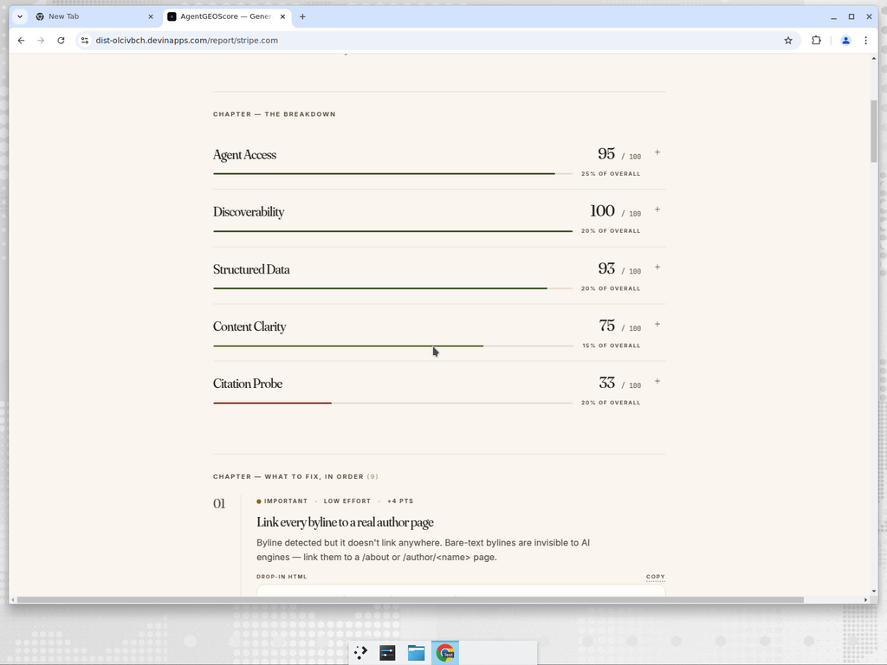
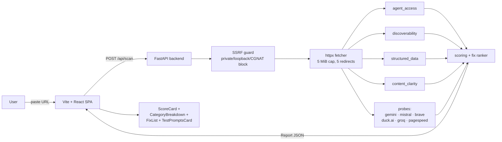

<div align="center">

# AgentGEOScore

**Generative Engine Optimization — score & grade any site for AI-agent visibility.**

[](https://github.com/LindaHaviv/agentgeoscore/actions/workflows/ci.yml)
[](LICENSE)
[](backend/tests)
[](frontend/src/test)
[](CODE_OF_CONDUCT.md)

[**Live demo**](https://agentgeoscore.com/) · [**The GEO paper**](https://arxiv.org/abs/2311.09735) · [**Contributing**](CONTRIBUTING.md) · [**Security**](SECURITY.md) · [**Changelog**](CHANGELOG.md)

<picture>
  <source srcset="docs/hero-breakdown.webp" type="image/webp">
  
</picture>

</div>

---

## Contents

- [Why GEO?](#why-geo)
- [What's actually measured](#whats-actually-measured)
- [Architecture](#architecture)
- [Stack](#stack)
- [Project layout](#project-layout)
- [Getting started](#getting-started)
- [Optional API keys](#optional-api-keys)
- [Scripts](#scripts)
- [Privacy](#privacy)
- [Hardening](#hardening)
- [Contributing](#contributing)
- [Security](#security)
- [Code of Conduct](#code-of-conduct)
- [License](#license)
- [Acknowledgements](#acknowledgements)

---

## Why GEO?

Search is moving from blue links to synthesized answers. When someone asks ChatGPT "what should I use for payments?", they don't see a SERP — they see one or two paragraphs with a handful of cited sources. If your site isn't in that synthesis, it doesn't exist for that user, no matter how it ranks in Google.

**The rules of being citable by an LLM are not the rules of being ranked by Google.** They overlap, but they aren't the same:

- AI crawlers (GPTBot, ClaudeBot, PerplexityBot, Google-Extended, …) need to be explicitly allowed — `User-agent: *` is not enough.
- Most agents don't execute JavaScript. A polished SPA shell with empty `<div id="root">` is invisible to them.
- LLMs heavily prefer pages with rich structured data — JSON-LD `Organization`, `Article`, `FAQPage`, `Product` — and clean semantic HTML.
- Citability comes from authority signals an LLM can verify in seconds: a clear author byline that links to a real `/about` page, ≥1500 words on the topic, schema.org coverage, and inbound mentions from sites the model already trusts.

AgentGEOScore is the field-study toolkit for this — paste a URL, get a graded report, ship the fixes, verify with real prompts to real models.

Built on top of the [Princeton GEO benchmark](https://arxiv.org/abs/2311.09735) (Aggarwal et al., 2024), with eight additional gap scanners shipped on top.

## What's actually measured

Paste a URL, get:

- a **0–100 score** + letter grade **A–F**
- a **category breakdown** across 5 axes (agent access, discoverability, structured data, content clarity, citation probe)
- a **ranked fix list** — what to do first, with copy-pasteable HTML snippets and expected score-lift per fix
- a **head-to-head comparison** against any competitor URL — same scoring grid, side-by-side
- **AI-search test prompts** auto-generated for the site's category, with deep-links to ChatGPT / Perplexity / Claude / Google AI Mode (so you can verify visibility in the field, not just on paper)
- a **dynamic OG share card** for every report

**Live**: <https://agentgeoscore.com/>
**Backend**: <https://api.agentgeoscore.com> (Fly.io, region `ams`, auto-stops idle machines)

The score blends 5 weighted categories (40 individual checks). Each check is grounded in a citation from the AI-search literature or a documented platform behavior — none of it is vibes.

| Category          | Weight | Sample checks |
|-------------------|:------:|---------------|
| Agent Access      | 25%    | robots.txt exists, AI-bot rules, CDN AI gating, HTTPS, redirects clean |
| Discoverability   | 20%    | sitemap.xml, canonical URL, homepage TTFB, **SPA / JS-rendering detection**, **multipage depth sample** |
| Structured Data   | 20%    | JSON-LD presence, `@type` coverage, microdata, **JSON-LD validator-conformance per @type**, **hreflang correctness** |
| Content Clarity   | 15%    | title + meta length, exactly one `<h1>`, semantic landmarks, text:HTML ratio, **content-depth signal (Princeton 1500–2500 word band)**, **internal-linking quality** |
| Citation Probe    | 20%    | % of LLMs that cite the domain (Gemini, Mistral, Brave, Duck.ai, Groq) + **Core Web Vitals via PageSpeed Insights** |

**Grade bands**: A ≥ 90 · B ≥ 75 · C ≥ 60 · D ≥ 40 · else F.

The newer signals (in **bold** above) shipped as eight evidence-backed gap PRs:

1. **SPA / JS-rendering detection** — flags client-rendered shells most AI crawlers can't read
2. **Multipage sample audit** — fetches 5–10 internal pages and checks per-page signal coverage so a single polished homepage can't carry the whole score
3. **Competitor baseline** — `/api/compare` endpoint + side-by-side card
4. **Content-depth signal** — scores deepest sampled page against the Princeton 1500–2500 word band
5. **JSON-LD validator-conformance** — verifies required props per `@type` (Article needs `headline`, `Product` needs `offers`, etc.)
6. **Internal linking** — anchor-text quality + orphan detection
7. **Core Web Vitals** — Google PageSpeed Insights API integration
8. **hreflang / i18n** — return-tag pairs, x-default presence, language-tag validity

## Architecture



Every outbound URL is SSRF-guarded, every endpoint is rate-limited, every response carries HSTS + CSP + nosniff + frame-ancestors. See [Hardening](#hardening) for the threat-model summary or [`SECURITY.md`](SECURITY.md) for the full one.

## Stack

- **Backend**: FastAPI + httpx, typed with Pydantic. Managed with [`uv`](https://docs.astral.sh/uv/).
- **Frontend**: Vite + React + TypeScript + Tailwind.
- **Tests**: `pytest` + `respx` (backend, 605 tests, 95% line coverage), `vitest` + `@testing-library/react` (frontend unit, 152 tests, ~100% on action code), Playwright + `@axe-core/playwright` (e2e + a11y across desktop / tablet / mobile viewports).
- **CI**: GitHub Actions — lint, typecheck, unit, build, e2e, Lighthouse, custom web-gates.
- **Deploy**: Backend → Fly.io at `api.agentgeoscore.com` (auto-deploys on push to `main` from `Dockerfile`). Frontend → Cloudflare Pages at `agentgeoscore.com` (auto-deploys on push to `main` from `frontend/`).

## Project layout

```
agentgeoscore/
├── backend/
│   ├── app/
│   │   ├── main.py              # POST /api/scan, POST /api/compare, GET /api/share/og
│   │   ├── models.py            # Pydantic
│   │   ├── scoring.py           # category + overall scoring, fix ranking
│   │   ├── compare.py           # head-to-head competitor scoring
│   │   ├── fixes.py             # check_id → Fix (severity / effort / score_lift / snippet)
│   │   ├── fetcher.py           # async httpx client; sets Accept-Language: en-US
│   │   ├── test_prompts.py      # category lexicon + AI-search prompt generation
│   │   ├── test_prompts_llm.py  # optional Groq llama-3.3-70b polish pass
│   │   ├── og.py                # dynamic OG share-card SVG → PNG
│   │   ├── llms_suggest.py      # llms.txt off-page recommendation generator
│   │   ├── scanners/            # agent_access, discoverability, structured_data, content_clarity
│   │   │                        # (each gap above is a scanner module)
│   │   └── probes/              # gemini, mistral, brave, duck_ai, groq, pagespeed
│   └── tests/                   # pytest + respx mocks
├── frontend/
│   ├── src/
│   │   ├── pages/               # HomePage, ReportPage, NotFoundPage
│   │   ├── components/          # URLInput, ScoreCard, CategoryBreakdown, FixList,
│   │   │                        # CompareCard, TestPromptsCard, RecommendationsCard
│   │   ├── api.ts, types.ts, brand.ts
│   └── tests/e2e/               # Playwright + axe
├── Dockerfile, fly.toml         # Fly deploy config
└── .agents/skills/deploy/       # operational runbook for redeploys
```

## Getting started

### Backend

```bash
cd backend
uv sync --extra dev
uv run --extra dev uvicorn app.main:app --reload --port 8000
```

- `GET  /api/healthz` — liveness check
- `POST /api/scan` — `{ "url": "https://stripe.com" }` → full `Report`
- `POST /api/compare` — `{ "url": "...", "competitor_url": "..." }` → side-by-side scoring
- `GET  /api/share/og?url=...` — dynamic OG share card (PNG)

### Frontend

```bash
cd frontend
npm install
npm run dev        # http://localhost:5173
```

The dev server proxies `/api` to `http://localhost:8000` — run the backend in parallel.

## Optional API keys

All probes degrade gracefully when their key is missing — the row reports a clean "skip" with a link to the free-tier signup, and the rest of the report still renders.

| Env var               | What it powers |
|-----------------------|----------------|
| `GEMINI_API_KEY`      | Gemini 2.5-flash citation probe (Google Search grounded) |
| `MISTRAL_API_KEY`     | Mistral citation probe |
| `BRAVE_API_KEY`       | Brave Search citation probe (Perplexity-adjacent signal) |
| `GROQ_API_KEY`        | Groq `compound-beta` citation probe **and** the optional LLM-polish pass over AI-search test prompts (`llama-3.3-70b-versatile`). Polish falls back to template prompts if missing or the call fails. |
| `PAGESPEED_API_KEY`   | Core Web Vitals scanner (gap #7) — Google PageSpeed Insights |
| _(none)_              | Duck.ai best-effort browser-less probe always runs |

All keys are server-side. End users never see, paste, or know about them.

## Scripts

| Path     | Command                            | What it does                              |
|----------|------------------------------------|-------------------------------------------|
| backend  | `uv run --extra dev pytest -q`     | Unit + integration tests (`respx` mocked) |
| backend  | `uv run --extra dev ruff check .`  | Lint                                      |
| frontend | `npm run lint`                     | ESLint                                    |
| frontend | `npm run typecheck`                | `tsc --noEmit`                            |
| frontend | `npm test -- --run`                | Vitest                                    |
| frontend | `npm run build`                    | Production bundle                         |
| frontend | `npm run test:e2e`                 | Playwright + axe (auto-starts Vite)       |
| frontend | `node scripts/capture-hero.mjs`    | Re-capture README hero screenshot from the live demo (writes `docs/hero-breakdown.{png,webp}`; set `BASE_URL` to override). One-time setup: `npx playwright install chromium` and optionally `brew install webp`. |

## Privacy

- No scan results are persisted server-side (history tracking is on the roadmap as gap #9, opt-in and cookie-free).
- No auth, no cookies, no third-party tracking.
- Probe API keys never leave the backend.

## Hardening

The backend is a public-facing fetch-arbitrary-URLs service, so it's hardened accordingly:

- **SSRF guard** ([`backend/app/url_safety.py`](backend/app/url_safety.py)) — every outbound URL (and every redirect hop) is validated against private / loopback / link-local / multicast / reserved / CGNAT IP ranges. Bare-IP and non-default-port inputs are rejected up front.
- **Per-IP rate limits** via [slowapi](https://github.com/laurentS/slowapi) — `/api/scan` 10/min, `/api/compare` 5/min, `/api/test-prompts` 30/min, `/api/og` 60/min, plus a 120/min global default.
- **Bounded responses** — fetcher caps body size at 5 MiB and follows at most 5 redirects.
- **Tight CORS** — defaults to the configured `FRONTEND_ORIGIN` plus localhost for dev. `*` only when explicitly opted into via `ALLOWED_ORIGINS=*`.
- **Defence-in-depth headers** on every response: HSTS (1y, includeSubDomains), `X-Content-Type-Options: nosniff`, `X-Frame-Options: DENY`, strict CSP (`default-src 'none'` + scoped allowlist), `Referrer-Policy: strict-origin-when-cross-origin`, `Permissions-Policy` denying camera/mic/geo/FLoC.
- **Non-root container** — Dockerfile drops to uid 10001 before exec.

See [`SECURITY.md`](SECURITY.md) for the full threat model, known limitations (DNS rebinding), and how to report a vulnerability.

---

## Contributing

PRs welcome. See [`CONTRIBUTING.md`](CONTRIBUTING.md) for the full checklist — gap-scanner template, category-lexicon rules, SEO-shell regression guards, and operational notes.

## Security

Found a vulnerability? Please **don't** open a public issue — see [`SECURITY.md`](SECURITY.md) for the disclosure process. Short version: email `linda.haviv@gmail.com`, get an ack within 5 days, ship a coordinated fix.

## Code of Conduct

This project follows the [Contributor Covenant 2.1](CODE_OF_CONDUCT.md). By participating, you agree to abide by it.

## License

MIT. See [`LICENSE`](LICENSE).

## Acknowledgements

The scoring methodology pulls from the GEO literature — most directly from Princeton's GEO benchmark paper (Aggarwal et al., 2024) for the content-depth and citability signals. The category lexicon was hand-curated from a sample of ~200 real homepages across verticals; pull requests to expand it are very welcome.
